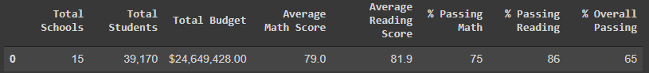
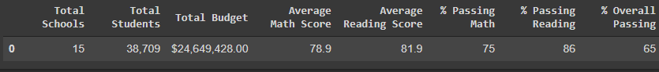
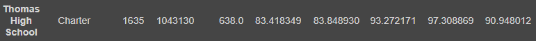
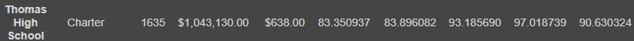
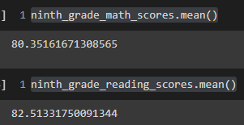
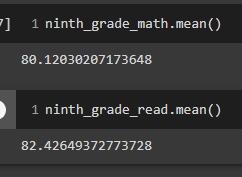
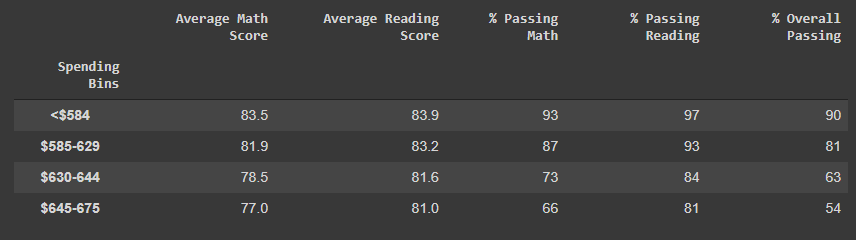
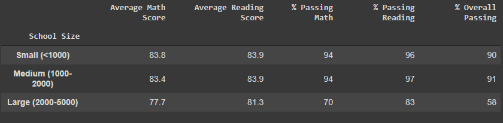
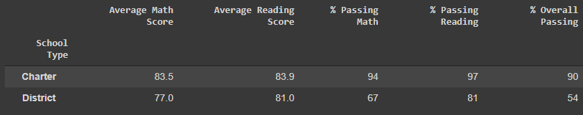

# School_District_Analysis

##Overview 
###Purpose of the Analysis
The purpose of the analysis is to take school and student performance data to create table data with outcomes for various categories, after replacing corrupted data with nulls.

##Results
###After removing the corrupt data:
- The district summary did not significantly change
  - before:  .
  - after:  .
- The school summary also did not change significantly 
  - before:  .
  - after:  .
- Thomas High School remained second in overall percentage passing rank 
- Math and reading scores for the ninth grade did not change significantly
  - before:  .
  - after:  .
- Scores by school spending did not change  .
- Scores by school size did not change .
- Scores by school type did not change  .

##Summary of Changes
###After we replaced the reading and math scores for the ninth grade at Thomas High School with NaNs:
We no longer have any data for the 9th grade Thomas High sub-category. The student count is reduced, so averages and percentages are based on this different total. The district summary, school summary, and average ninth grade reading and math scores changed slightly, as seen in the screenshots. 
